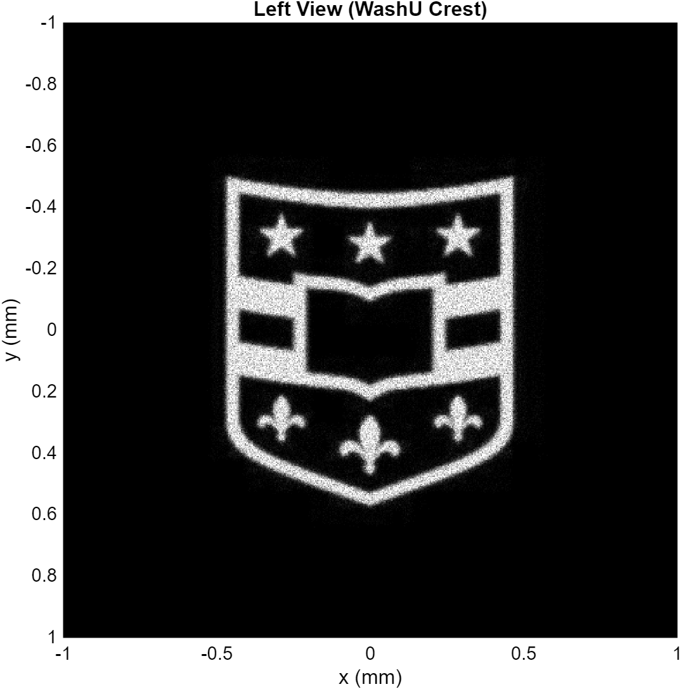
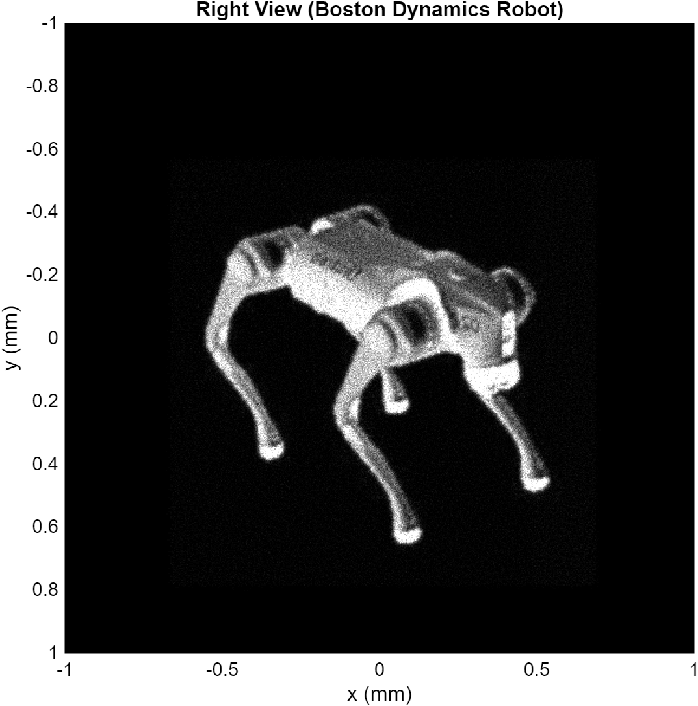

# 🔬 ESE 105 – Case Study 3: Light Field Imaging & Scientific Autofocus

A MATLAB implementation of a computational light field camera that reconstructs focused images from millions of raw rays using matrix optics — and holographically separates multiple objects encoded at different angles.

---

## What This Does

Light field cameras capture not just *where* light hits a sensor, but *which direction* it's traveling. This project processes a raw light field (3+ million rays, each described by position and angle) to:

1. **Reconstruct focused images** from blurry ray data using lens matrix optics
2. **Automatically find the optimal focus distance** via a coarse-to-fine gradient-based search
3. **Separate three distinct objects** encoded at different illumination angles — like a hologram

The three objects hidden in the light field:
| Object | Encoding Angle |
|---|---|
| WashU Crest | Left (negative θ) |
| Bruno Sinopoli (portrait) | Center (θ ≈ 0) |
| Boston Dynamics Robot | Right (positive θ) |

---

## Results

<table>
  <tr>
    <td align="center"><b>Left Object</b><br>WashU Crest</td>
    <td align="center"><b>Right Object</b><br>Boston Dynamics Robot</td>
  </tr>
  <tr>
    <td></td>
    <td></td>
  </tr>
</table>

---

## How It Works

### Ray Transfer Matrices

Each ray is represented as a 4-vector `[x, θ_x, y, θ_y]`. Optical elements are modeled as matrix multiplications:

**Free-space propagation** (distance `d`):
```
M_d = [1  d  0  0]
      [0  1  0  0]
      [0  0  1  d]
      [0  0  0  1]
```

**Thin lens** (focal length `f`):
```
M_f = [1     0  0     0]
      [-1/f  1  0     0]
      [0     0  1     0]
      [0     0  -1/f  1]
```

The full system: `rays_out = M_d2 * M_f * rays_in`

### Autofocus Algorithm (`CS3Comp.m`)

Focus quality is measured by the **gradient magnitude** of the rendered image — a sharp image has strong edges, a blurry one doesn't.

```
score = Σ √(Gx² + Gy²)   over all pixels
```

**Two-stage search:**
- **Coarse:** Sweep `d2` from 80–200 mm (200 samples), find the peak
- **Fine:** Narrow sweep ±1 step around the coarse peak (100 samples, 400×400 px)

Dynamic sensor width is set to `6σ` of the ray distribution to keep the object framed at all zoom levels.

**Result:** Optimal focus at `d2 ≈ 133.8 mm` (f = 100 mm lens)

### Object Separation (`CS3Separation.m`)

Objects were encoded into the light field from three different angles. Separation works by:

1. Histogramming `θ_x` (incoming ray angle) to find three peaks
2. Automatically computing midpoint cutoffs + 20 mrad guard bands
3. Filtering rays by angle → applying optics → rendering each subset independently
4. Contrast enhancement (1%–99.5% percentile stretch)

---

## File Structure

```
├── CS3P1.m          # Part 1: Ray tracing through free space and a finite lens
├── CS3P2.m          # Part 2: Manual focus hunting on the light field
├── CS3Comp.m        # Part 3: Automated coarse-to-fine autofocus
├── CS3Separation.m  # Part 4: Angular separation of holographic objects
├── rays2img.m       # Utility: bins rays onto a pixel grid (provided)
├── Left_Object.png  # Reconstructed WashU Crest
└── Right_Object.png # Reconstructed Boston Dynamics Robot
```

> `lightField.mat` (~3M rays, 4×N matrix) is not included due to file size. Contact for access.

---

## Key Parameters

| Parameter | Value |
|---|---|
| Lens focal length | 100 mm |
| Optimal image distance | ~133.8 mm |
| Coarse search range | 80–200 mm |
| Final image resolution | 500×500 px |
| Separation resolution | 800×800 px |
| Angular guard band | 20 mrad |

---

## Running the Code

Requires MATLAB with the Image Processing Toolbox. Place `lightField.mat` and `rays2img.m` in your working directory, then run scripts in order:

```matlab
CS3P1        % Ray tracing fundamentals
CS3P2        % Manual focus exploration  
CS3Comp      % Automated autofocus (saves d2_final to workspace)
CS3Separation % Object separation (uses d2_final from CS3Comp)
```

---

## Background

This project was completed as Case Study 3 for **ESE 105** at Washington University in St. Louis. The light field paradigm — capturing full 4D ray information rather than a 2D projection — underlies technologies like Lytro cameras, microscopy with post-capture refocusing, and computational photography pipelines.
